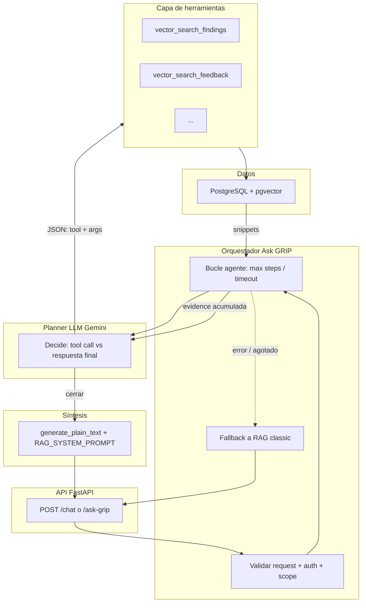

# Ask GRIP — Diseño de agente conversacional (borrador para retomar)

> **Estado:** diseño exploratorio (no sustituye aún a `GRIP-SDD-Functional-Specs.md` ni a `api-contract-ssot.md`).  
> **Relación con otras features:** independiente de [ingestion-pdf-ai-v1.md](ingestion-pdf-ai-v1.md) (M1-PDF). Cuando se implemente, promover a spec formal SDD y alinear versión en `GRIP-SDD-Functional-Specs.md` y `backend_audit_report.md`.

## 1. Objetivo

- **Problema:** El flujo actual de Ask GRIP (`app/services/rag_service.py`, `ask_grip`) hace **un** embedding de la pregunta, recupera hasta **5** fragmentos (findings + strategic_feedback mezclados) y **una** llamada a `generate_plain_text`. Las preguntas ejecutivas ambiguas o multi‑fondo no se benefician de reformulación, segunda búsqueda ni razonamiento por pasos.
- **Propuesta:** Introducir un **agente ligero** (bucle acotado) que use **herramientas** (funciones determinísticas sobre PostgreSQL / pgvector) y un modelo de lenguaje (Gemini) con **límites de coste, latencia y trazabilidad**, manteniendo la resiliencia descrita en [GRIP-SDD-Functional-Specs.md §3.F](../GRIP-SDD-Functional-Specs.md).

## 2. Referencias normativas

| Documento | Uso |
|-----------|-----|
| [GRIP-SDD-Functional-Specs.md §3.D / Módulo 4](../GRIP-SDD-Functional-Specs.md) | RAG, prompts base, intención de “memoria operativa”. |
| [GRIP-SDD-Functional-Specs.md §3.F](../GRIP-SDD-Functional-Specs.md) | Resiliencia IA: `try/except`, degradación, no bloquear transacciones críticas. |
| [GRIP-SDD-Functional-Specs.md](../GRIP-SDD-Functional-Specs.md) | Rol CEO / Ask GRIP en journeys (ajustar cuando el agente cambie permisos o UX). |
| Código actual | `app/services/rag_service.py`, `app/api/chat.py`, `app/api/rag.py`. |

## 3. Estado actual (baseline)

- **Entrada:** `query` (string), `store_code` opcional (filtra hallazgos por tienda si existe en BD).
- **Pipeline:** `generate_embedding(query)` → búsqueda vectorial en `findings` (top 5, con filtro opcional) + `strategic_feedback` (top 5) → unión → orden por distancia → **top 5 global** → texto de contexto → `generate_plain_text(user_prompt, RAG_SYSTEM_PROMPT)`.
- **System prompt fijo:** *“Eres la memoria operativa de GRIP…”* (frase literal requerida por spec; cualquier agente debe **preservarla o ampliarla sin contradecirla**).
- **Salida:** `answer` + `evidence[]` (snippets con `source_type`, `source_id`, `score`, `excerpt`).

## 4. Arquitectura

### 4.1 Vista en capas

El agente no sustituye las reglas de negocio ni ejecuta SQL arbitrario. La **inteligencia de orquestación** vive en código Python; el LLM solo **planifica** (elegir herramienta y argumentos o cerrar) y **sintetiza** la respuesta final con el mismo `RAG_SYSTEM_PROMPT` que el flujo actual.



### 4.2 Componentes y responsabilidades

| Pieza | Ubicación sugerida | Responsabilidad |
|-------|-------------------|-----------------|
| **Router** | `app/api/chat.py`, `app/api/rag.py` | HTTP, auth, body; opcional `mode=classic\|agent`. |
| **Orquestador** | Nuevo módulo p. ej. `ask_grip_orchestrator.py` o funciones en `rag_service` | Bucle con `MAX_AGENT_STEPS`, timeout, deduplicación de evidencia, invocación del planner, ejecución de tools, construcción del prompt final o **fallback** a `ask_grip` (classic). |
| **Planner** | Llamadas Gemini con salida JSON estricta | Devuelve `{ "action": "tool", "name", "args" }` o `{ "action": "finish" }` (o equivalente); no accede a la BD directamente. |
| **Tool registry** | Dict nombre → callable | Args validados con Pydantic; recibe `Session`, `CurrentUser`, límites. |
| **Herramientas** | Reutilizan lógica de `ask_grip` | Embeddings + `cosine_distance`; `query_text` puede diferir de la pregunta del usuario. |
| **Síntesis** | `generate_plain_text` | Mismo contrato que hoy: contexto + pregunta + `RAG_SYSTEM_PROMPT`. |

### 4.3 Flujo de datos por petición (modo agent)

1. Entrada: `query`, `store_code` opcional, usuario autenticado.
2. Orquestador inicializa `evidence[]`, `step = 0`.
3. Planner recibe pregunta, resumen de evidencia acumulada (y contexto de tienda si aplica); devuelve acción estructurada.
4. Si **tool**: validar args → ejecutar → añadir snippets a `evidence` (deduplicar por `source_type` + `source_id`) → `step++` → si `step < MAX`, volver al paso 3.
5. Si **finish** o evidencia suficiente o pasos agotados: montar bloque “Contexto recuperado” y llamar síntesis; o activar fallback classic.
6. Salida HTTP: `answer` + `evidence` (+ `meta` opcional: `steps_used`, `degraded`, `mode`).

### 4.4 Dónde está la “inteligencia”

- **No** en SQL generado por el modelo.
- **Sí** en: (1) decidir qué buscar y con qué texto (reformulación / sub-preguntas), (2) combinar resultados en la respuesta final.

### 4.5 Integración con el código existente

- `generate_embedding` y `generate_plain_text` permanecen en `app/core/ai_client.py` (política de errores §3.F).
- El pipeline **classic** actual (`ask_grip`) puede invocarse como rama interna del orquestador para evitar duplicar retrieval.

### 4.6 Opcional

- **Feature flag** en orquestador: si agente desactivado, solo classic.
- **Tracing:** logs estructurados o OpenTelemetry (`step`, `tool`, `latency_ms`) sin persistir vectores completos.

## 5. Visión del agente

### 5.1 Principios

1. **Herramientas primero:** Toda lectura de BD pasa por funciones con **SQL validado** y **scopes** (zona, rol, `store_code`). El modelo no ejecuta SQL libre.
2. **Presupuesto fijo:** `MAX_AGENT_STEPS` (p. ej. 3–5), `MAX_TOOL_CALLS` por petición, timeout total (p. ej. 25–40 s).
3. **Un solo proveedor LLM** alineado al stack: Gemini (mismo cliente que hoy, con manejo de `GeminiAPIError` / `GeminiQuotaError`).
4. **Degradación:** Si el agente falla o agota pasos, **fallback** al comportamiento actual (single-shot RAG) o respuesta parcial + mensaje claro.
5. **Trazabilidad:** Opcional en API: `trace_steps[]` (solo interno o flag `debug` para admins) con `{step, tool, args_resumidos, resultado_resumido}`.

### 5.2 Rol del LLM en cada paso

- **Planner (ligero):** Dado el historial corto (pregunta + contexto acumulado), decide: *llamar herramienta X* o *responder final*.
- **Responder:** Misma obligación que hoy: basarse en evidencia recuperada; citar riesgo sistémico si el contexto lo permite (coherente con `RAG_SYSTEM_PROMPT`).

Implementación posible sin framework externo: bucle `async for step in range(MAX_STEPS)` con JSON estructurado (`action: tool_name | answer`, `tool_args`, `final_text`).

## 6. Catálogo de herramientas (propuesta v1)

| ID | Nombre | Comportamiento | Entrada típica |
|----|--------|----------------|----------------|
| T1 | `vector_search_findings` | Igual que hoy: embedding de un **sub‑query** (no solo la pregunta original), top-k, filtro `store_code` opcional. | `query_text`, `store_code?`, `limit` (≤5) |
| T2 | `vector_search_feedback` | Igual que hoy sobre `strategic_feedback`. | `query_text`, `limit` (≤5) |
| T3 | `keyword_search_findings` | Opcional fase 2: ILIKE / full-text sobre campos ya indexados (si se añade índice o se limita a `store_code`). | `terms`, `store_code?`, `limit` |
| T4 | `get_store_metadata` | Resumen no sensible: nombre tienda, zona (si aplica scope), última visita reciente — **solo** si el rol lo permite. | `store_code` |

**Nota:** T3/T4 son extensiones; la **MVP del agente** puede limitarse a **T1 + T2** con *query de búsqueda* generada por el planner a partir de la pregunta del usuario (reformulación / descomposición).

## 7. Flujo del agente (algoritmo)

```text
1. Validar entrada (query no vacía, usuario autenticado, permisos — heredados del router).
2. Inicializar contexto_evidence = [].
3. Opcional: generar 1–3 "sub-preguntas" o una "query de búsqueda mejorada" (una llamada corta al LLM o heurística).
4. Por cada paso hasta MAX_AGENT_STEPS:
   a. El modelo devuelve estructura { action: "tool" | "answer", ... }.
   b. Si "tool": ejecutar herramienta, añadir snippets a contexto_evidence (deduplicar por source_id+type).
   c. Si "answer": construir user_prompt final con snippets + pregunta original; llamar generate_plain_text con RAG_SYSTEM_PROMPT; return.
5. Si se agotan pasos: fallback a pipeline actual (una pasada embedding sobre query original) o mensaje de degradación.
```

## 8. Contrato API (evolución sugerida)

**Opción A (mínima):** Mantener `POST /api/v1/chat` y `POST /api/v1/query/ask-grip` sin cambios de forma; activar el agente con **feature flag** (`ASK_GRIP_AGENT_ENABLED`, header, o config por entorno).

**Opción B (explícita):** Nuevo campo opcional en el body:

```json
{
  "query": "…",
  "store_code": "…",
  "mode": "classic" | "agent"
}
```

Por defecto `classic` hasta validar en staging.

**Respuesta extendida (opcional):**

```json
{
  "answer": "…",
  "evidence": [ ],
  "meta": {
    "mode": "agent",
    "steps_used": 2,
    "degraded": false
  }
}
```

Cualquier cambio de contrato deberá reflejarse después en `GRIP-SDD-Functional-Specs.md`, `api-contract-ssot.md` y schemas Pydantic (`app/schemas/rag.py`).

## 9. Seguridad y gobierno de datos

- **Scope territorial:** Reutilizar la misma lógica que `GET /findings` / `CurrentUser.zone_id` para que las herramientas no devuelvan hallazgos fuera de la zona del usuario (salvo CEO según reglas de producto).
- **No exponer PII innecesaria** en `excerpt`; truncar como hoy (~500 caracteres).
- **Rate limiting:** Reutilizar o añadir límite por usuario en el endpoint de chat (el agente multiplica llamadas a Gemini).

## 10. Observabilidad y coste

- **Métricas:** `ask_grip_requests_total`, `ask_grip_agent_steps_histogram`, `ask_grip_gemini_calls_per_request`, errores por tipo (cuota vs API).
- **Logs:** Correlación `request_id`; log de herramientas invocadas sin volcar embeddings completos.

## 11. Fases de implementación recomendadas

| Fase | Contenido | Riesgo |
|------|-----------|--------|
| **0** | Documento aprobado + flag off | — |
| **1** | Reformulación de query (1 LLM call) + mismo retrieval que hoy | Bajo |
| **2** | Bucle con T1/T2 y planner JSON; límites de pasos; fallback classic | Medio |
| **3** | T3/T4, trazas opcionales, tests de carga | Medio-Alto |

## 12. Criterios de aceptación (borrador)

1. Con `mode=classic`, el comportamiento es **equivalente** al actual (misma forma de `evidence` salvo mejoras documentadas).
2. Con `mode=agent`, la respuesta usa solo evidencia obtenida vía herramientas en esa petición (o indica explícitamente falta de contexto).
3. Ante `GeminiQuotaError`, el cliente recibe HTTP 429 o mensaje degradado según política unificada con el resto de la API.
4. Ningún paso del agente persiste datos de negocio sin pasar por los servicios y reglas ya existentes.

## 13. Notas

- Este archivo **no** incrementa la versión de `GRIP-SDD-Functional-Specs.md` hasta que el equipo promueva la feature a implementación (SDD).
- Frontend: si se expone `mode` o nuevos campos en la respuesta, actualizar el servicio de chat en Angular y la spec de UI en la feature correspondiente.

---

*Última revisión del diseño: 2026-03-23 (añadida §4 Arquitectura: capas, componentes, flujo de datos).*
